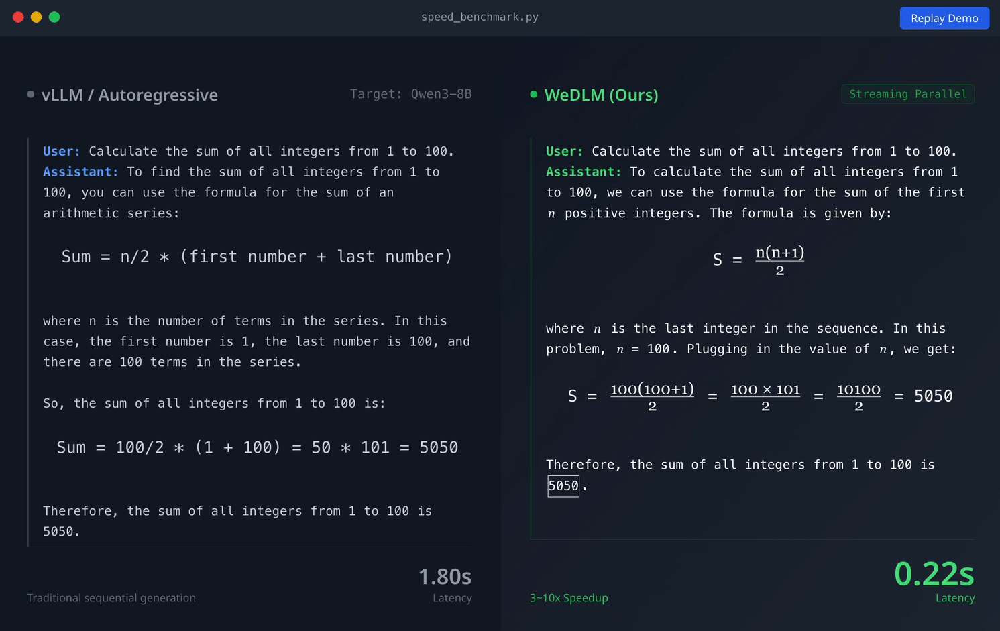
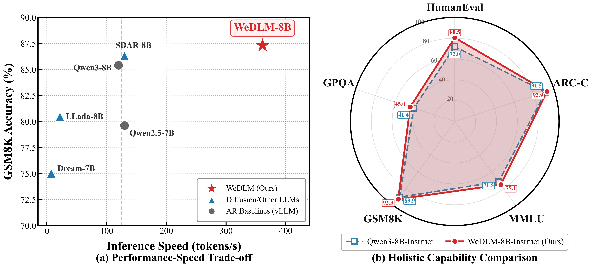
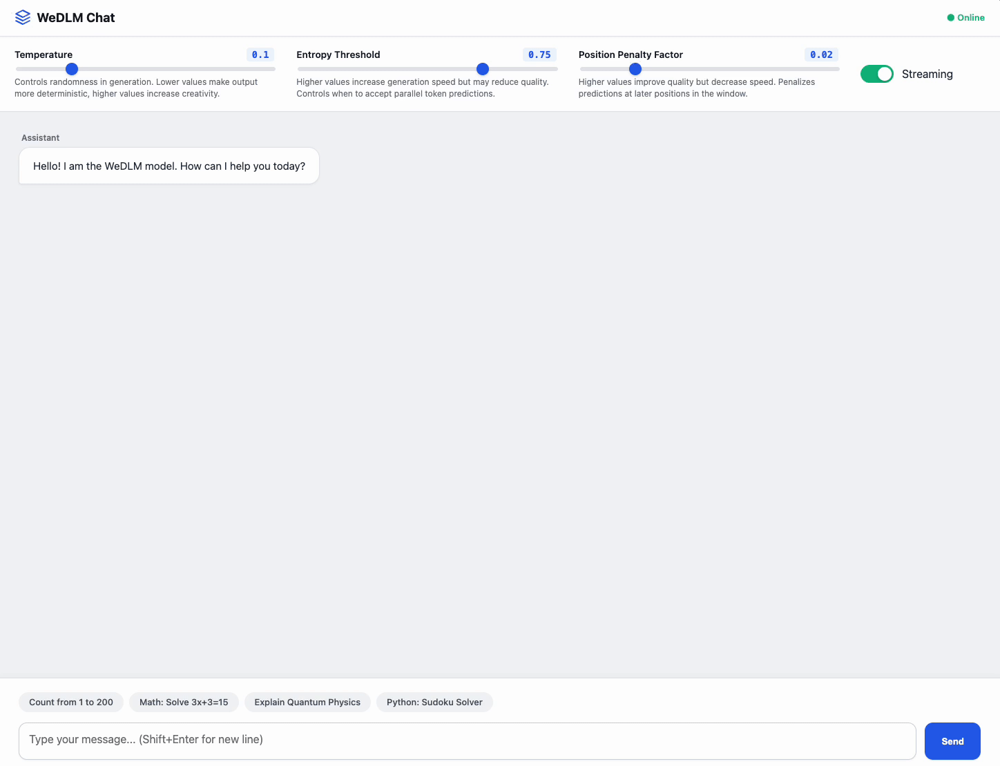

<div align="center">

# WeDLM

### Reconciling Diffusion Language Models with Standard Causal Attention for Fast Inference

<p><b>WeChat AI, Tencent</b></p>

<br>

<!-- Badges with better spacing -->
<p>
<a href="https://arxiv.org/abs/2512.22737"></a>
&nbsp;
<a href="https://wedlm.github.io"></a>
&nbsp;
<a href="LICENSE"></a>
&nbsp;
<a href="https://huggingface.co/collections/tencent/wedlm"></a>
</p>

<br>

<!-- Highlight Box -->
<table>
<tr>
<td>
<h3>🏆 The fastest diffusion language model, capable of outperforming vLLM-optimized autoregressive baselines in wall-clock speed</h3>
</td>
</tr>
</table>

<br>

<!-- Demo GIF -->

<p><i>⬆️ Real-time comparison: Qwen3-8B-Instruct with vLLM (left) vs WeDLM-8B-Instruct (right) on the same prompt</i></p>

</div>

<br>

</div>

---

## 💡 Why WeDLM?

Most diffusion language models use bidirectional attention, which breaks KV cache compatibility and fails to translate parallel prediction into actual speedups over optimized AR engines like vLLM.

**WeDLM solves this** by performing parallel mask recovery under *standard causal attention*, enabling:

*   ✅ **Native KV cache compatibility** (FlashAttention, PagedAttention, CUDA Graphs)
*   ✅ **Direct initialization** from pre-trained AR models (Qwen2.5, Qwen3)
*   ✅ **Real speedups** measured against production-grade vLLM baselines

<div align="center">

<br>
<em><b>GSM8K benchmark:</b> WeDLM achieves 3-6× speedup over vLLM while maintaining competitive accuracy.</em>
</div>

---

## 🚀 Quick Start

### Installation

```bash
git clone https://github.com/tencent/WeDLM.git
cd WeDLM && bash install.sh
```

<details>
<summary><b>Manual Installation</b></summary>

```bash
# Step 1: PyTorch
pip install torch==2.8.0+cu129 --index-url https://download.pytorch.org/whl/cu129

# Step 2: flash-attn build dependencies
pip install psutil ninja packaging

# Step 3: flash-attn (requires torch first)
pip install flash-attn==2.7.4.post1 --no-build-isolation

# Step 4: WeDLM
git clone https://github.com/tencent/WeDLM.git
cd WeDLM && pip install -e .
```

</details>

<details>
<summary><b>Docker Installation</b></summary>

```bash
# Pull the Docker image
docker pull aiweiliu/wedlm:v3

# Run the container with GPU support
docker run -it --gpus all -p 8080:8080 --name wedlm aiweiliu/wedlm:v3 /bin/bash

# Inside the container, run inference directly
python example.py --model tencent/WeDLM-8B-Instruct

# Inside the container, run web demo
python web_demo.py --model tencent/WeDLM-8B-Instruct
```

</details>

### Run Inference

```bash
# Run simple generation
python example.py --model tencent/WeDLM-8B-Instruct
```

**Example Output (NVIDIA H20):**

```text
Prompt: A store sells apples for $2 each and oranges for $3 each...

Response: To determine the total amount Tom spent...
Therefore, the total amount Tom spent is $22.

==================================================
  Generated tokens: 218
  Time elapsed: 0.32 seconds
  Speed: 689.18 tokens/s ⚡
==================================================
```

### 💻 Interactive Demo & API

**Web Demo:**

```bash
python web_demo.py --model tencent/WeDLM-8B-Instruct
```

<div align="center">

<p><i>⬆️ Interactive web interface for real-time generation</i></p>
</div>

**Python API:**

```python
from transformers import AutoTokenizer
from wedlm import LLM, SamplingParams

# Initialize
llm = LLM(model="tencent/WeDLM-8B-Instruct")
tokenizer = AutoTokenizer.from_pretrained("tencent/WeDLM-8B-Instruct", trust_remote_code=True)

# Prepare Prompt
prompt = "Solve: 2x + 5 = 13"
messages = [{"role": "user", "content": prompt}]
text = tokenizer.apply_chat_template(messages, tokenize=False, add_generation_prompt=True)

# Generate
outputs = llm.generate([text], SamplingParams(temperature=0.0, max_tokens=512))
print(outputs[0]["text"])
```

---

## 📊 Performance

### Speed-Quality Tradeoff

WeDLM's speedup varies by task characteristics. Structured, low-entropy tasks (math, code) see the largest gains.

| Scenario | Speedup vs vLLM | Notes |
|:---|:---:|:---|
| **Math Reasoning** (GSM8K, MATH) | **3-6×** | Structured output, high confidence predictions |
| **Code Generation** | **2-3×** | Predictable syntax patterns |
| **Sequential/Counting Tasks** | **Up to 10×** | Highly deterministic outputs |
| **Open-ended QA** | **1.5-2×** | Higher entropy limits parallel acceptance |

> [!NOTE]
> Acceleration comes with a quality-speed tradeoff. Conservative settings preserve accuracy; aggressive settings maximize speed. See our paper for detailed analysis.

### Generation Quality

WeDLM preserves and often improves upon its base AR model capabilities.

<details open>
<summary><b>🏆 Base Models Benchmark</b> (Click to collapse)</summary>
<br>

| Benchmark | Qwen2.5-7B | Qwen3-8B | LLaDA-8B | Dream-7B | **WeDLM-7B** | **WeDLM-8B** |
|:---|:---:|:---:|:---:|:---:|:---:|:---:|
| ARC-C | 89.93 | 92.66 | 81.14 | 88.40 | 90.70 | **92.92** |
| GSM8K | 79.23 | 85.97 | 71.80 | 75.97 | 84.76 | **90.20** |
| MATH | 43.40 | 50.80 | 28.00 | 38.00 | 48.20 | **53.60** |
| HumanEval | 59.14 | 68.90 | 31.71 | 20.12 | 68.90 | **75.00** |
| MMLU | 71.62 | 74.03 | 64.61 | 70.64 | 71.93 | **75.46** |
| **Average** | 67.21 | 72.61 | 55.44 | 56.91 | 70.84 | **74.72** |

</details>

<details>
<summary><b>🎓 Instruct Models Benchmark</b> (Click to expand)</summary>
<br>

| Benchmark | Qwen2.5-7B-Inst | Qwen3-8B-Inst | SDAR-8B-Inst | **WeDLM-7B-Inst** | **WeDLM-8B-Inst** |
|:---|:---:|:---:|:---:|:---:|:---:|
| ARC-C | 86.09 | 91.47 | 91.13 | 89.59 | **92.92** |
| GSM8K | 89.91 | 89.91 | 91.66 | 87.57 | **92.27** |
| MATH | 45.00 | **69.60** | 43.40 | 55.40 | 64.80 |
| HumanEval | 76.22 | 71.95 | 76.83 | 75.00 | **80.49** |
| MMLU | 71.98 | 71.52 | 73.61 | 70.52 | **75.14** |
| **Average** | 71.09 | 75.12 | 74.22 | 72.78 | **77.53** |

</details>

---

## 🦁 Model Zoo

| Model | Base | Context | Download |
|:---|:---|:---:|:---:|
| **WeDLM-7B** | Qwen2.5-7B | 32k | [](https://huggingface.co/tencent/WeDLM-7B-Base) |
| **WeDLM-7B-Instruct** | Qwen2.5-7B | 32k | [](https://huggingface.co/tencent/WeDLM-7B-Instruct) |
| **WeDLM-8B** | Qwen3-8B | 32k | [](https://huggingface.co/tencent/WeDLM-8B-Base) |
| **WeDLM-8B-Instruct** ⭐ | Qwen3-8B | 32k | [](https://huggingface.co/tencent/WeDLM-8B-Instruct) |

---

## 🛠️ Advanced Usage

### Installation from Source

**Requirements:** Python 3.9+, PyTorch 2.1+, CUDA 11.8+

```bash
git clone https://github.com/tencent/WeDLM.git
cd WeDLM && bash install.sh
```

> [!NOTE]
> `flash-attn` requires compilation and must be installed after PyTorch.
> The `install.sh` script handles this automatically (default: CUDA 12.9).
> For other CUDA versions: `CUDA_VERSION=cu124 bash install.sh`

### Evaluation

Reproduce our results using the provided scripts:

```bash
# 1. Download datasets
python -m evaluation.download_datasets --all

# 2. Run evaluation (e.g., GSM8K)
bash evaluation/evaluation_base.sh \
    --model_path "tencent/WeDLM-8B-Instruct" \
    --output_dir "output/" \
    --datasets "gsm8k" \
    --num_gpus 8
```

*See `evaluation/demo.sh` for all benchmark commands.*

### HuggingFace Compatibility

For training or simple forward passes, we provide a standard HF interface.

> [!WARNING]
> **For fast inference, use the `wedlm` engine** (shown in Quick Start). The HF interface below is for training/forward pass convenience only.

```python
from transformers import AutoTokenizer, AutoModelForCausalLM

tokenizer = AutoTokenizer.from_pretrained("tencent/WeDLM-8B-Instruct", trust_remote_code=True)
model = AutoModelForCausalLM.from_pretrained("tencent/WeDLM-8B-Instruct", trust_remote_code=True)

inputs = tokenizer("Hello", return_tensors="pt")
out = model(**inputs)
```

---

## 🧠 How It Works

WeDLM introduces **Topological Reordering** to perform parallel mask recovery under standard causal attention, combined with **Streaming Parallel Decoding** for continuous prefix commitment.

*   👉 **[Project Page](https://wedlm.github.io)** — Interactive explanations and visualizations
*   👉 **[Paper](https://arxiv.org/abs/2512.22737)** — Technical details and full experimental results

---

## 📜 Citation

If you find WeDLM useful for your research, please cite:

```bibtex
@article{liu2025wedlm,
  title={WeDLM: Reconciling Diffusion Language Models with Standard Causal Attention for Fast Inference},
  author={Liu, Aiwei and He, Minghua and Zeng, Shaoxun and Zhang, Linhao and Wu, Chuhan and Jia, Wei and Liu, Yuan and Yu, Yang and Zhou, Xiao and Zhou, Jie},
  journal={arXiv preprint arXiv:2512.22737},
  year={2025}
}
```

## Acknowledgement

Built upon [nano-vllm](https://github.com/GeeeekExplorer/nano-vllm), [Qwen](https://github.com/QwenLM/Qwen), and [vLLM](https://github.com/vllm-project/vllm).

## License

[Apache 2.0](LICENSE)
